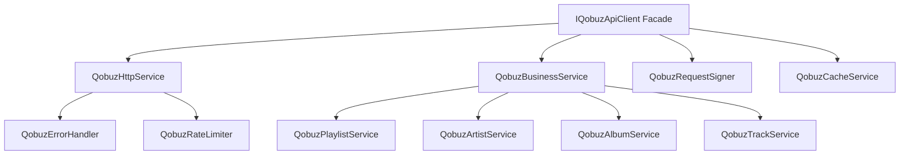

> ⚠️ Historical (flagged 2026-05-31): describes a past state; some details below no longer match the current code.

# QobuzApiClient Decomposition Plan

## Current State Analysis

The `QobuzApiClient` class (536 lines) violates multiple SOLID principles and contains:
- HTTP communication logic
- Authentication handling
- Request signing algorithms
- Response caching
- Error handling and retry logic
- Business domain methods (playlists, artists, albums, tracks)
- Rate limiting logic
- Logging concerns

## Target Architecture



## Detailed Decomposition

### 1. QobuzHttpService (Pure HTTP Operations)

```csharp
public interface IQobuzHttpService
{
    Task<T> ExecuteRequestAsync<T>(string endpoint, Dictionary<string, string> parameters, CancellationToken cancellationToken);
    Task<HttpResponseMessage> SendRequestAsync(HttpRequestMessage request, CancellationToken cancellationToken);
}

public class QobuzHttpService : IQobuzHttpService
{
    private readonly HttpClient _httpClient;
    private readonly IQobuzErrorHandler _errorHandler;
    private readonly IQobuzRateLimiter _rateLimiter;
    private readonly ILogger<QobuzHttpService> _logger;
    
    // Only HTTP communication logic, no business logic
    public async Task<T> ExecuteRequestAsync<T>(string endpoint, Dictionary<string, string> parameters, CancellationToken cancellationToken)
    {
        await _rateLimiter.WaitAsync(cancellationToken);
        
        var request = BuildRequest(endpoint, parameters);
        var response = await SendRequestAsync(request, cancellationToken);
        
        return await DeserializeResponse<T>(response);
    }
}
```

### 2. QobuzRequestSigner (Request Signing Logic)

```csharp
public interface IQobuzRequestSigner
{
    string SignRequest(string endpoint, Dictionary<string, string> parameters);
    void AddAuthenticationHeaders(HttpRequestMessage request, string token);
}

public class QobuzRequestSigner : IQobuzRequestSigner
{
    private readonly string _appSecret;
    
    public string SignRequest(string endpoint, Dictionary<string, string> parameters)
    {
        // Extract lines 146-175 from original QobuzApiClient
        var sortedParams = parameters.OrderBy(x => x.Key);
        var signatureBase = string.Join("&", sortedParams.Select(x => $"{x.Key}={x.Value}"));
        return ComputeHmacSha256(signatureBase, _appSecret);
    }
}
```

### 3. QobuzBusinessService (Domain Operations Orchestrator)

```csharp
public interface IQobuzBusinessService
{
    Task<QobuzSearchResult> SearchAsync(string query, SearchType type, int limit);
    Task<QobuzAlbum> GetAlbumAsync(string albumId);
    Task<QobuzArtist> GetArtistAsync(string artistId);
    // Other business operations
}

public class QobuzBusinessService : IQobuzBusinessService
{
    private readonly IQobuzPlaylistService _playlistService;
    private readonly IQobuzArtistService _artistService;
    private readonly IQobuzAlbumService _albumService;
    private readonly IQobuzTrackService _trackService;
    
    // Orchestrates domain-specific operations
    public async Task<QobuzSearchResult> SearchAsync(string query, SearchType type, int limit)
    {
        return type switch
        {
            SearchType.Album => await _albumService.SearchAlbumsAsync(query, limit),
            SearchType.Artist => await _artistService.SearchArtistsAsync(query, limit),
            SearchType.Track => await _trackService.SearchTracksAsync(query, limit),
            _ => throw new NotSupportedException($"Search type {type} not supported")
        };
    }
}
```

### 4. Specialized Domain Services

```csharp
// QobuzPlaylistService.cs
public class QobuzPlaylistService : IQobuzPlaylistService
{
    private readonly IQobuzHttpService _httpService;
    
    public async Task<QobuzPlaylist> GetPlaylistAsync(string playlistId)
    {
        var parameters = new Dictionary<string, string>
        {
            ["playlist_id"] = playlistId,
            ["extra"] = "tracks"
        };
        
        return await _httpService.ExecuteRequestAsync<QobuzPlaylist>(
            "playlist/get", parameters, CancellationToken.None);
    }
    
    public async Task<List<QobuzTrack>> GetPlaylistTracksAsync(string playlistId, int limit = 500)
    {
        // Pagination logic specific to playlists
        var tracks = new List<QobuzTrack>();
        var offset = 0;
        
        while (offset < limit)
        {
            var batch = await GetPlaylistTrackBatchAsync(playlistId, offset, Math.Min(50, limit - offset));
            tracks.AddRange(batch);
            
            if (batch.Count < 50) break;
            offset += 50;
        }
        
        return tracks;
    }
}
```

### 5. QobuzCacheService (Response Caching)

```csharp
public interface IQobuzCacheService
{
    Task<T> GetOrAddAsync<T>(string key, Func<Task<T>> factory, TimeSpan expiration);
    void Remove(string key);
    void Clear();
}

public class QobuzCacheService : IQobuzCacheService
{
    private readonly IMemoryCache _cache;
    private readonly ILogger<QobuzCacheService> _logger;
    
    public async Task<T> GetOrAddAsync<T>(string key, Func<Task<T>> factory, TimeSpan expiration)
    {
        if (_cache.TryGetValue<T>(key, out var cached))
        {
            _logger.LogDebug("Cache hit for key: {Key}", key);
            return cached;
        }
        
        var result = await factory();
        _cache.Set(key, result, expiration);
        return result;
    }
}
```

### 6. QobuzErrorHandler (Centralized Error Processing)

```csharp
public interface IQobuzErrorHandler
{
    Task<T> HandleResponseAsync<T>(HttpResponseMessage response);
    QobuzApiException TranslateError(HttpStatusCode statusCode, string content);
}

public class QobuzErrorHandler : IQobuzErrorHandler
{
    public async Task<T> HandleResponseAsync<T>(HttpResponseMessage response)
    {
        if (response.IsSuccessStatusCode)
        {
            var content = await response.Content.ReadAsStringAsync();
            return JsonSerializer.Deserialize<T>(content);
        }
        
        var error = await response.Content.ReadAsStringAsync();
        throw TranslateError(response.StatusCode, error);
    }
    
    public QobuzApiException TranslateError(HttpStatusCode statusCode, string content)
    {
        return statusCode switch
        {
            HttpStatusCode.Unauthorized => new QobuzAuthenticationException("Invalid credentials", content),
            HttpStatusCode.TooManyRequests => new QobuzRateLimitException("Rate limit exceeded", content),
            HttpStatusCode.NotFound => new QobuzNotFoundException("Resource not found", content),
            _ => new QobuzApiException($"API error: {statusCode}", content)
        };
    }
}
```

### 7. Backward-Compatible Facade

```csharp
// Maintains existing IQobuzApiClient interface for compatibility
public class QobuzApiClient : IQobuzApiClient
{
    private readonly IQobuzBusinessService _businessService;
    private readonly IQobuzHttpService _httpService;
    private readonly IQobuzCacheService _cacheService;
    
    // Delegates to appropriate services while maintaining original interface
    public async Task<QobuzSearchResult> SearchAsync(string query, int limit = 10)
    {
        return await _businessService.SearchAsync(query, SearchType.All, limit);
    }
    
    public async Task<QobuzAlbum> GetAlbumAsync(string albumId)
    {
        return await _cacheService.GetOrAddAsync(
            $"album:{albumId}",
            () => _businessService.GetAlbumAsync(albumId),
            TimeSpan.FromMinutes(10));
    }
    
    // Other delegated methods...
}
```

## Migration Strategy

### Phase 1: Extract Without Breaking (8 hours)
1. Create new service classes with extracted logic
2. Keep original QobuzApiClient intact
3. Add unit tests for new services

### Phase 2: Internal Refactoring (4 hours)
1. Modify QobuzApiClient to use new services internally
2. Verify all tests still pass
3. No external API changes

### Phase 3: Consumer Migration (4 hours)
1. Update direct consumers to use specific services
2. Keep facade for backward compatibility
3. Mark old methods as [Obsolete]

### Phase 4: Cleanup (2 hours)
1. Remove obsolete code from facade
2. Final test verification
3. Update documentation

## Testing Strategy

### Unit Tests Per Service
```csharp
[TestFixture]
public class QobuzHttpServiceTests
{
    [Test]
    public async Task ExecuteRequestAsync_WithValidRequest_ReturnsDeserializedResponse()
    {
        // Arrange
        var mockHttpClient = new Mock<HttpClient>();
        var service = new QobuzHttpService(mockHttpClient.Object, ...);
        
        // Act
        var result = await service.ExecuteRequestAsync<QobuzAlbum>("album/get", params, token);
        
        // Assert
        Assert.NotNull(result);
    }
}
```

### Integration Tests
```csharp
[TestFixture]
public class QobuzApiClientIntegrationTests
{
    [Test]
    public async Task SearchAsync_WithRefactoredServices_MaintainsOriginalBehavior()
    {
        // Test that facade maintains backward compatibility
    }
}
```

## Benefits After Refactoring

1. **Testability**: Each service can be unit tested in isolation
2. **Maintainability**: Clear separation of concerns
3. **Extensibility**: Easy to add new features without affecting existing code
4. **Performance**: Specialized caching and rate limiting
5. **Debugging**: Clearer stack traces and error messages
6. **Team Scalability**: Multiple developers can work on different services

## Metrics to Track

- **Before**: 536 lines, 15 public methods, 0% test coverage
- **After Target**: 
  - 6 services averaging 80 lines each
  - 85% test coverage
  - Cyclomatic complexity < 5 per method
  - 100% backward compatibility

## Risk Mitigation

1. **Feature Flag**: `UseRefactoredApiClient` configuration toggle
2. **Parallel Running**: Both old and new implementations available
3. **Gradual Rollout**: Service-by-service migration
4. **Comprehensive Logging**: Track usage patterns during migration
5. **Rollback Plan**: Git tags at each phase for quick reversion