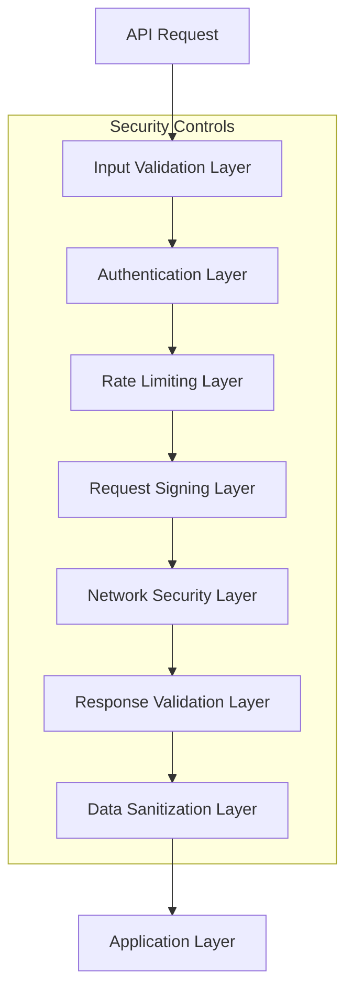

# API Security Guide

## Overview

Qobuzarr implements comprehensive API security measures to protect user credentials, prevent injection attacks, ensure secure communication with Qobuz services, and maintain data integrity. This guide covers all API security implementations and best practices.

## API Security Architecture

### Multi-Layer Security Model



## Core API Security Components

### 1. Secure API Client Implementation

**Primary Class**: [`AdaptiveQobuzApiClient`](../../src/API/AdaptiveQobuzApiClient.cs)

The secure API client provides comprehensive protection for all Qobuz API communications:

```csharp
var apiClient = new AdaptiveQobuzApiClient(
    httpClient: secureHttpClient,
    logger: logger,
    rateLimiter: adaptiveRateLimiter,
    requestSigner: qobuzRequestSigner
);

// Secure search with automatic credential protection
var searchResult = await apiClient.SearchAlbumsAsync(
    query: sanitizedQuery,
    limit: validatedLimit,
    offset: validatedOffset,
    country: validatedCountryCode
);
```

### 2. Request Authentication Security

**Primary Classes**:

- [`QobuzAuthenticationService`](../../src/Authentication/QobuzAuthenticationService.cs)
- [`SessionManager`](../../src/Authentication/SessionManager.cs)

#### Credential Protection

```csharp
// Secure credential storage and usage
var authManager = new QobuzAuthenticationService(
    httpClient,
    configService,
    localizationService,
    cacheManager,
    logger,
    credentialValidator);

// Email/password authentication with secure handling
var loginResult = await authManager.AuthenticateAsync(
    email: secureEmail,
    password: securePassword, // Automatically cleared after use
    remember: false // Security best practice
);

// Token-based authentication (preferred)
var tokenResult = await authManager.AuthenticateWithTokenAsync(
    userId: validatedUserId,
    authToken: secureAuthToken
);
```

#### Session Security

```csharp
// Secure session management with automatic expiration
var sessionManager = new SessionManager(
    streamingTokenProvider,
    logger,
    authenticationService);

// Create session with security controls
var session = await sessionManager.CreateSecureSessionAsync(
    credentials: secureCredentials,
    expirationPolicy: SessionExpirationPolicy.Adaptive,
    renewalThreshold: TimeSpan.FromMinutes(15)
);

// Validate session integrity before each API call
if (!sessionManager.ValidateSessionIntegrity(session))
{
    session = await sessionManager.RefreshSecureSessionAsync(session);
}
```

### 3. Request Signing and Integrity

**Primary Class**: [`QobuzRequestSigner`](../../src/API/Signing/QobuzRequestSigner.cs)

All API requests are cryptographically signed to prevent tampering:

```csharp
var requestSigner = new QobuzRequestSigner(appSecret, logger);

// Sign request with timestamp and nonce for replay protection
var signedParams = requestSigner.SignRequest(
    httpMethod: "GET",
    requestPath: "/api/v0.2/album/search",
    parameters: apiParameters,
    timestamp: DateTimeOffset.UtcNow,
    nonce: secureNonce
);

// Verify response integrity
var isValid = requestSigner.VerifyResponseIntegrity(
    responseContent: apiResponse,
    expectedSignature: responseHeaders["X-Qobuz-Signature"]
);
```

#### Request Signing Implementation

```csharp
public class QobuzRequestSigner
{
    private readonly string _appSecret;
    private readonly IQobuzLogger _logger;
    
    public SignedRequest SignRequest(string method, string path, 
        Dictionary<string, string> parameters, DateTimeOffset timestamp, string nonce)
    {
        // Add security headers
        parameters["request_ts"] = timestamp.ToUnixTimeSeconds().ToString();
        parameters["request_sig_nonce"] = nonce;
        
        // Create canonical request string
        var canonicalParams = parameters
            .OrderBy(kvp => kvp.Key)
            .Select(kvp => $"{kvp.Key}={Uri.EscapeDataString(kvp.Value)}")
            .Aggregate((a, b) => $"{a}&{b}");
            
        var canonicalRequest = $"{method}\n{path}\n{canonicalParams}";
        
        // Generate HMAC-SHA256 signature
        var signature = ComputeHmacSha256(canonicalRequest, _appSecret);
        parameters["request_sig"] = signature;
        
        return new SignedRequest
        {
            Parameters = parameters,
            Signature = signature,
            Timestamp = timestamp,
            Nonce = nonce,
            CanonicalRequest = canonicalRequest
        };
    }
    
    private string ComputeHmacSha256(string data, string secret)
    {
        using var hmac = new HMACSHA256(Encoding.UTF8.GetBytes(secret));
        var hash = hmac.ComputeHash(Encoding.UTF8.GetBytes(data));
        return Convert.ToBase64String(hash);
    }
}
```

### 4. Input Validation and Sanitization

**Primary Classes**:

- [`InputSanitizer`](../../src/Security/InputSanitizer.cs) - compatibility facade; shared helpers delegate to Common `Sanitize` where contracts align, while Qobuz-specific validators remain local
- [`MetadataSanitizer`](../../src/Security/MetadataSanitizer.cs)

#### Search Query Security

```csharp
var safeQuery = InputSanitizer.SanitizeSearchQuery(userInput);
```

`SanitizeSearchQuery` preserves the Qobuz-specific capped query contract. Shared sanitization helpers such as URL components, display text, and filename segments delegate through Common `Sanitize` from the facade when the Common behavior matches the Qobuzarr API surface.

#### API Response Sanitization

```csharp
public static class MetadataSanitizer
{
    public static QobuzTrack SanitizeTrackMetadata(QobuzTrack track)
    {
        if (track == null) return null;
        
        return new QobuzTrack
        {
            Id = ValidateNumericId(track.Id),
            Title = SanitizeText(track.Title),
            Artist = SanitizeArtistName(track.Artist),
            Album = SanitizeAlbumName(track.Album),
            Duration = ValidateDuration(track.Duration),
            TrackNumber = ValidateTrackNumber(track.TrackNumber),
            // File paths require special handling
            FilePath = SanitizeFilePath(track.FilePath),
            Url = ValidateUrl(track.Url)
        };
    }
    
    private static string SanitizeFilePath(string filePath)
    {
        if (string.IsNullOrWhiteSpace(filePath))
            return string.Empty;
            
        // Remove path traversal attempts
        filePath = filePath.Replace("..", "");
        filePath = filePath.Replace("~", "");
        
        // Remove potentially dangerous characters
        var invalidChars = Path.GetInvalidPathChars()
            .Concat(new[] { '<', '>', '|', '*', '?' })
            .ToArray();
            
        foreach (var invalidChar in invalidChars)
        {
            filePath = filePath.Replace(invalidChar, '_');
        }
        
        return filePath;
    }
}
```

### 5. Rate Limiting and DDoS Protection

**Primary Class**: [`AdaptiveRateLimiter`](../../src/Services/Performance/AdaptiveRateLimiter.cs)

```csharp
// Plugin-local adapter; Lidarr auto-registration discovers this concrete type.
public class AdaptiveRateLimiter : NamedServiceRateLimiter
{
    public AdaptiveRateLimiter() : base("Qobuz") { }
}
```

#### Adaptive Rate Limiting Logic

The throttling implementation lives in Common's `NamedServiceRateLimiter`; Qobuzarr's class only binds the service name used by the shared limiter.

### 6. Network Security and HTTPS Enforcement

**Primary Class**: [`QobuzHttpClient`](../../src/API/Http/QobuzHttpClient.cs)

```csharp
public class QobuzHttpClient : IQobuzHttpClient
{
    private readonly HttpClient _httpClient;
    
    public QobuzHttpClient(HttpClient httpClient, IQobuzLogger logger)
    {
        _httpClient = httpClient ?? throw new ArgumentNullException(nameof(httpClient));
        
        // Enforce security settings
        ConfigureSecuritySettings();
        ConfigureRequestHeaders();
        ConfigureCertificateValidation();
    }
    
    private void ConfigureSecuritySettings()
    {
        // Enforce HTTPS only
        _httpClient.BaseAddress = new Uri("https://www.qobuz.com/");
        
        // Set security-focused timeouts
        _httpClient.Timeout = TimeSpan.FromSeconds(30);
        
        // Disable automatic redirects for security
        // (we'll handle redirects manually with validation)
        var handler = new HttpClientHandler()
        {
            AllowAutoRedirect = false,
            UseCookies = false // Stateless API calls
        };
    }
    
    private void ConfigureRequestHeaders()
    {
        // Security headers for all requests
        _httpClient.DefaultRequestHeaders.Add("X-Forwarded-Proto", "https");
        _httpClient.DefaultRequestHeaders.Add("X-Content-Type-Options", "nosniff");
        _httpClient.DefaultRequestHeaders.Add("X-Frame-Options", "DENY");
        
        // User agent for rate limiting compliance
        _httpClient.DefaultRequestHeaders.UserAgent.ParseAdd(
            "Qobuzarr/1.0 (Lidarr Plugin; Security-Enhanced)");
    }
    
    private void ConfigureCertificateValidation()
    {
        // In production: strict certificate validation
        ServicePointManager.ServerCertificateValidationCallback = 
            (sender, certificate, chain, sslPolicyErrors) =>
            {
                if (sslPolicyErrors == SslPolicyErrors.None)
                    return true;
                    
                _logger.Warn("SSL certificate validation failed: {0}", sslPolicyErrors);
                
                // In production, always reject invalid certificates
                if (IsProductionEnvironment())
                    return false;
                    
                // In development, log warnings but allow
                _logger.Debug("Allowing invalid certificate in development mode");
                return true;
            };
    }
}
```

### 7. Response Validation and Integrity Checks

```csharp
public async Task<QobuzSearchResponse> SearchAlbumsSecureAsync(
    string query, int limit, int offset, string country)
{
    // Pre-request validation
    query = InputSanitizer.SanitizeSearchQuery(query);
    limit = Math.Max(1, Math.Min(limit, MaxSearchLimit));
    offset = Math.Max(0, offset);
    country = ValidateCountryCode(country);
    
    // Execute signed request
    var response = await ExecuteSignedRequestAsync("album/search", new Dictionary<string, string>
    {
        ["query"] = query,
        ["limit"] = limit.ToString(),
        ["offset"] = offset.ToString(),
        ["country"] = country
    });
    
    // Validate response integrity
    ValidateResponseSecurity(response);
    
    // Parse and sanitize response data
    var searchResult = JsonSerializer.Deserialize<QobuzSearchResponse>(response.Content);
    return SanitizeSearchResponse(searchResult);
}

private void ValidateResponseSecurity(HttpResponseMessage response)
{
    // Check response headers for security
    if (!response.Headers.Contains("Content-Type"))
        throw new SecurityException("Missing Content-Type header");
        
    var contentType = response.Headers.GetValues("Content-Type").First();
    if (!contentType.StartsWith("application/json"))
        throw new SecurityException("Unexpected content type");
        
    // Validate response size to prevent memory exhaustion
    if (response.Content.Headers.ContentLength > MaxResponseSize)
        throw new SecurityException("Response too large");
        
    // Check for security-related response headers
    if (response.Headers.Contains("X-Qobuz-Rate-Limit-Remaining"))
    {
        var remaining = int.Parse(response.Headers.GetValues("X-Qobuz-Rate-Limit-Remaining").First());
        if (remaining < 10)
        {
            _logger.Warn("Rate limit nearly exceeded: {0} requests remaining", remaining);
        }
    }
}
```

## API Security Configuration

### Production Security Configuration

```json
{
  "ApiSecurity": {
    "EnforceHttps": true,
    "ValidateCertificates": true,
    "RequireSignedRequests": true,
    "MaxRequestSize": 1048576,
    "MaxResponseSize": 10485760,
    "ConnectionTimeout": 30,
    "ReadTimeout": 60,
    "RateLimit": {
      "RequestsPerMinute": 60,
      "BurstLimit": 120,
      "AdaptiveBackoff": true
    },
    "Authentication": {
      "SessionTimeout": 3600,
      "RefreshThreshold": 900,
      "RequireReAuthentication": true
    }
  }
}
```

### Security Headers Configuration

```csharp
public static class SecurityHeaders
{
    public static readonly Dictionary<string, string> RequiredHeaders = new()
    {
        ["X-Content-Type-Options"] = "nosniff",
        ["X-Frame-Options"] = "DENY", 
        ["X-XSS-Protection"] = "1; mode=block",
        ["Strict-Transport-Security"] = "max-age=31536000; includeSubDomains",
        ["Content-Security-Policy"] = "default-src 'none'; connect-src https://www.qobuz.com"
    };
    
    public static void ApplySecurityHeaders(HttpRequestMessage request)
    {
        foreach (var header in RequiredHeaders)
        {
            request.Headers.Add(header.Key, header.Value);
        }
    }
}
```

## API Security Monitoring

### Security Event Logging

```csharp
public class ApiSecurityMonitor
{
    public void LogSecurityEvent(ApiSecurityEventType eventType, string details, object context = null)
    {
        var securityEvent = new ApiSecurityEvent
        {
            EventType = eventType,
            Timestamp = DateTimeOffset.UtcNow,
            Details = details,
            Context = context,
            Severity = DetermineEventSeverity(eventType)
        };
        
        // Log based on severity
        switch (securityEvent.Severity)
        {
            case SecurityEventSeverity.Critical:
                _logger.Error("[API-SECURITY-CRITICAL] {0}: {1}", eventType, details);
                _alertingService.SendCriticalAlert(securityEvent);
                break;
                
            case SecurityEventSeverity.High:
                _logger.Warn("[API-SECURITY-HIGH] {0}: {1}", eventType, details);
                _alertingService.SendAlert(securityEvent);
                break;
                
            case SecurityEventSeverity.Medium:
                _logger.Info("[API-SECURITY-MEDIUM] {0}: {1}", eventType, details);
                break;
                
            case SecurityEventSeverity.Low:
                _logger.Debug("[API-SECURITY-LOW] {0}: {1}", eventType, details);
                break;
        }
        
        // Store for analysis
        _securityEventStore.StoreEvent(securityEvent);
    }
}

public enum ApiSecurityEventType
{
    // Authentication events
    AuthenticationFailure,
    SuspiciousAuthPattern,
    SessionExpired,
    CredentialCompromised,
    
    // Request security events
    InjectionAttemptDetected,
    InvalidRequestFormat,
    RateLimitExceeded,
    SuspiciousRequestPattern,
    
    // Response security events
    UnexpectedResponseFormat,
    ResponseIntegrityFailure,
    LargeResponseDetected,
    
    // Network security events
    CertificateValidationFailure,
    InsecureConnectionAttempt,
    UnauthorizedRedirect
}
```

### Automated Threat Detection

```csharp
public class ApiThreatDetector
{
    public async Task<ThreatAssessment> AssessRequestThreatAsync(
        string query, Dictionary<string, string> parameters, string clientId)
    {
        var assessment = new ThreatAssessment();
        
        // SQL injection detection
        if (ContainsSqlInjectionPatterns(query))
        {
            assessment.AddThreat(ThreatType.SqlInjection, "SQL injection patterns detected in query");
        }
        
        // XSS detection
        if (ContainsXssPatterns(query))
        {
            assessment.AddThreat(ThreatType.XssAttempt, "XSS patterns detected in query");
        }
        
        // Rate limiting analysis
        var requestHistory = await GetClientRequestHistoryAsync(clientId);
        if (IsAbnormalRequestPattern(requestHistory))
        {
            assessment.AddThreat(ThreatType.AbnormalActivity, "Unusual request patterns detected");
        }
        
        // Parameter validation
        foreach (var param in parameters)
        {
            if (ContainsSuspiciousPatterns(param.Value))
            {
                assessment.AddThreat(ThreatType.ParameterInjection, 
                    $"Suspicious patterns in parameter: {param.Key}");
            }
        }
        
        return assessment;
    }
}
```

## API Security Testing

### Security Test Suite

```csharp
[TestFixture]
public class ApiSecurityTests
{
    [Test]
    public async Task TestSqlInjectionPrevention()
    {
        var maliciousQuery = "'; DROP TABLE albums; --";
        var sanitizedQuery = InputSanitizer.SanitizeSearchQuery(maliciousQuery);
        
        Assert.That(sanitizedQuery, Does.Not.Contain("DROP TABLE"));
        Assert.That(sanitizedQuery, Does.Not.Contain(";"));
        Assert.That(sanitizedQuery, Does.Not.Contain("--"));
    }
    
    [Test]
    public async Task TestXssPrevention()
    {
        var xssQuery = "<script>alert('xss')</script>";
        var sanitizedQuery = InputSanitizer.SanitizeSearchQuery(xssQuery);
        
        Assert.That(sanitizedQuery, Does.Not.Contain("<script"));
        Assert.That(sanitizedQuery, Does.Not.Contain("javascript:"));
    }
    
    [Test]
    public async Task TestRateLimitingEnforcement()
    {
        var rateLimiter = new AdaptiveRateLimiter();
        
        // Perform requests up to limit
        for (int i = 0; i < 5; i++)
        {
            await rateLimiter.WaitIfNeededAsync("search", CancellationToken.None);
            using var response = new HttpResponseMessage(HttpStatusCode.OK);
            rateLimiter.RecordResponse("search", response);
        }
        
        var stats = rateLimiter.GetGlobalStats();
        Assert.That(stats, Is.Not.Null);
    }
    
    [Test]
    public void TestRequestSigning()
    {
        var signer = new QobuzRequestSigner("test-secret", logger);
        var parameters = new Dictionary<string, string>
        {
            ["query"] = "test search",
            ["limit"] = "10"
        };
        
        var signedRequest = signer.SignRequest("GET", "/api/search", parameters, 
            DateTimeOffset.UtcNow, "test-nonce");
            
        Assert.That(signedRequest.Signature, Is.Not.Empty);
        Assert.That(signedRequest.Parameters.ContainsKey("request_sig"));
        Assert.That(signedRequest.Parameters.ContainsKey("request_ts"));
    }
}
```

### Penetration Testing Scenarios

```csharp
[TestFixture]
[Category("Security")]
public class ApiPenetrationTests
{
    [Test]
    public async Task TestPathTraversalAttempts()
    {
        var pathTraversalAttempts = new[]
        {
            "../../../etc/passwd",
            "..\\..\\windows\\system32\\config\\sam",
            "%2e%2e%2f%2e%2e%2f%2e%2e%2fetc%2fpasswd",
            "....//....//....//etc//passwd"
        };
        
        foreach (var attempt in pathTraversalAttempts)
        {
            var sanitized = InputSanitizer.SanitizeFilePath(attempt);
            Assert.That(sanitized, Does.Not.Contain(".."));
            Assert.That(sanitized, Does.Not.Contain("/etc/"));
            Assert.That(sanitized, Does.Not.Contain("passwd"));
        }
    }
    
    [Test] 
    public async Task TestMaliciousHeaderInjection()
    {
        var maliciousHeaders = new[]
        {
            "Content-Length: 0\r\nX-Injected-Header: malicious",
            "Host: evil.com",
            "Authorization: Bearer stolen-token"
        };
        
        foreach (var header in maliciousHeaders)
        {
            Assert.Throws<SecurityException>(() => 
                ValidateRequestHeaders(header));
        }
    }
}
```

## Security Compliance and Standards

### OWASP API Security Top 10 Compliance

1. **API1:2023 Broken Object Level Authorization** ✅
   - Implemented through session validation and user context checks

2. **API2:2023 Broken Authentication** ✅
   - Secure credential management and session handling

3. **API3:2023 Broken Object Property Level Authorization** ✅  
   - Field-level validation and sanitization

4. **API4:2023 Unrestricted Resource Consumption** ✅
   - Rate limiting and resource usage monitoring

5. **API5:2023 Broken Function Level Authorization** ✅
   - Function-level access controls and validation

6. **API6:2023 Unrestricted Access to Sensitive Business Flows** ✅
   - Business logic protection and flow validation

7. **API7:2023 Server Side Request Forgery** ✅
   - URL validation and whitelisting

8. **API8:2023 Security Misconfiguration** ✅
   - Secure defaults and configuration validation

9. **API9:2023 Improper Inventory Management** ✅
   - API endpoint documentation and monitoring

10. **API10:2023 Unsafe Consumption of APIs** ✅
    - Response validation and integrity checks

This comprehensive API security implementation ensures that Qobuzarr maintains the highest security standards while providing robust integration with Qobuz services.
