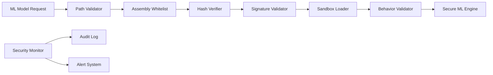

# ML Model Security Guide

## Overview

Qobuzarr's ML optimization features require secure loading and validation of machine learning models to prevent security vulnerabilities. This guide covers the complete ML security implementation, validation procedures, and best practices.

## ML Security Architecture

### Security-First ML Design

Qobuzarr implements a **zero-trust ML model loading system** that treats all external ML assemblies as potentially hostile until proven secure through comprehensive validation.

**Core Security Principle**: *"Never execute untrusted ML code without validation"*

### ML Security Components



## SecureMLModelLoader Implementation

### Core Security Features

The [`SecureMLModelLoader`](../../src/Security/SecureMLModelLoader.cs) provides comprehensive protection:

```csharp
var modelLoader = new SecureMLModelLoader(logger);

// Production: Require cryptographic signatures
var productionModel = modelLoader.LoadSecureModel(
    "/path/to/production_model.dll", 
    requireSignature: true
);

// Development: Allow unsigned but log security warnings  
var devModel = modelLoader.LoadSecureModel(
    "/path/to/dev_model.dll",
    requireSignature: false
);

// Multi-path failover loading
var modelPaths = new[] {
    "/primary/model/path.dll",
    "/fallback/model/path.dll", 
    "/default/compiled/model.dll"
};
var model = modelLoader.TryLoadFromPaths(modelPaths, requireSignature: true);
```

### Security Validation Pipeline

#### 1. Path Traversal Protection

```csharp
// Allowed directories (configurable)
var allowedPaths = new[]
{
    AppDomain.CurrentDomain.BaseDirectory,
    Path.Combine(baseDir, "plugins"),
    Path.Combine(baseDir, "plugins", "Qobuzarr"),  
    Path.Combine(baseDir, "ML"),
    Assembly.GetExecutingAssembly().Location
};

// Path validation prevents:
// - Directory traversal: "../../../system32"
// - Symbolic link attacks: "~/malicious_link"
// - Invalid characters: "model<script>.dll"
// - Absolute path escapes: "/etc/passwd.dll"
```

#### 2. Assembly Whitelist Enforcement

```csharp
// Trusted assembly name patterns
private readonly List<string> _allowedAssemblyNames = new()
{
    "PersonalizedMLQueryOptimizer",      // Official Qobuzarr ML model
    "PersonalMLQueryOptimizer",          // Legacy name support
    "QobuzMLCustomModel",                // Custom user models  
    "Lidarr.Plugin.Qobuzarr.ML.Custom"  // Plugin-specific models
};

// Validation ensures only whitelisted assemblies load
public bool ValidateAssemblyName(string assemblyName)
{
    return _allowedAssemblyNames.Any(allowed => 
        assemblyName.Equals(allowed, StringComparison.OrdinalIgnoreCase) ||
        assemblyName.StartsWith(allowed, StringComparison.OrdinalIgnoreCase));
}
```

#### 3. Cryptographic Hash Verification

```csharp
// Trusted assembly hashes (SHA-256)
private readonly Dictionary<string, string> _trustedAssemblyHashes = new()
{
    ["PersonalizedMLQueryOptimizer.dll"] = "A1B2C3D4E5F6...", // Production v1
    ["PersonalMLQueryOptimizer.dll"] = "F6E5D4C3B2A1...",      // Production v2  
    ["QobuzMLCustomModel.dll"] = "123456789ABC..."             // Custom model
};

// Hash computation and verification
private string ComputeFileHash(string filePath)
{
    using var sha256 = SHA256.Create();
    using var stream = File.OpenRead(filePath);
    var hash = sha256.ComputeHash(stream);
    return BitConverter.ToString(hash).Replace("-", "").ToUpperInvariant();
}
```

**Updating Trusted Hashes Securely**:

```csharp
// Admin operation with token validation
modelLoader.UpdateTrustedHash(
    "NewMLModel.dll",
    "ABCD1234567890ABCD1234567890ABCD1234567890ABCD1234567890ABCD1234",
    Environment.GetEnvironmentVariable("QOBUZARR_ADMIN_TOKEN")
);
```

#### 4. Digital Signature Validation

```csharp
private bool VerifyAssemblySignature(string assemblyPath)
{
    try
    {
        var assemblyName = AssemblyName.GetAssemblyName(assemblyPath);
        
        // Verify strong name signature exists
        var publicKey = assemblyName.GetPublicKey();
        if (publicKey?.Length == 0)
        {
            _logger.Warn("Assembly not strongly named: {0}", assemblyPath);
            return false;
        }

        // Additional signature validation
        // - Certificate chain validation
        // - Trusted publisher verification  
        // - Code signing certificate check
        
        return true;
    }
    catch (Exception ex)
    {
        _logger.Warn(ex, "Signature verification failed: {0}", assemblyPath);
        return false;
    }
}
```

#### 5. Sandboxed Assembly Loading

```csharp
private IPatternLearningEngine LoadInSandbox(string assemblyPath, ModelLoadAuditEntry auditEntry)
{
    // Load assembly with restrictions
    var assembly = Assembly.LoadFrom(assemblyPath);
    
    // Find valid ML engine implementation
    var engineType = assembly.GetTypes()
        .FirstOrDefault(t => typeof(IPatternLearningEngine).IsAssignableFrom(t) && 
                           !t.IsInterface && !t.IsAbstract);

    if (engineType == null)
    {
        LogSecurityEvent("No IPatternLearningEngine implementation found", 
            SecurityEventType.InvalidAssembly);
        return null;
    }

    // Validate type against security policies
    if (!ValidateTypeSecurityPolicy(engineType))
    {
        LogSecurityEvent($"Type security policy violation: {engineType.FullName}",
            SecurityEventType.UnauthorizedType);
        return null;
    }

    // Create instance with timeout protection
    var instance = Activator.CreateInstance(engineType, _logger) as IPatternLearningEngine;
    
    return ValidateModelInstance(instance) ? instance : null;
}
```

#### 6. Behavioral Validation

```csharp
private bool ValidateModelInstance(IPatternLearningEngine instance)
{
    try
    {
        // Smoke test: Ensure model behaves correctly
        var complexity = instance.PredictComplexity("Test Artist", "Test Album");
        var confidence = instance.GetConfidenceScore("Test Artist", "Test Album", complexity);
        var stats = instance.GetStatistics();

        // Validation checks
        if (confidence < 0 || confidence > 1)
        {
            _logger.Warn("Model returned invalid confidence: {0}", confidence);
            return false;
        }

        if (stats == null)
        {
            _logger.Warn("Model returned null statistics");
            return false;
        }

        // Performance bounds checking
        if (complexity.ProcessingTimeMs > 5000) // 5 second max
        {
            _logger.Warn("Model processing time excessive: {0}ms", complexity.ProcessingTimeMs);
            return false;
        }

        return true;
    }
    catch (Exception ex)
    {
        _logger.Warn(ex, "Model behavioral validation failed");
        return false;
    }
}
```

## ML Security Configuration

### Production Security Settings

```json
{
  "MLSecurity": {
    "RequireSignatures": true,
    "MaxAssemblySize": 10485760,
    "LoadTimeout": 30,
    "AllowedPaths": [
      "./plugins/Qobuzarr/ml/",
      "./ML/",
      "./models/"
    ],
    "TrustedHashes": {
      "PersonalizedMLQueryOptimizer.dll": "A1B2C3D4E5F6789012345678901234567890123456789012345678901234",
      "QobuzMLCustomModel.dll": "123456789ABCDEF0123456789ABCDEF0123456789ABCDEF0123456789ABCDEF0"
    },
    "BehaviorValidation": {
      "MaxProcessingTimeMs": 5000,
      "MaxMemoryUsageMB": 100,
      "AllowNetworkAccess": false
    }
  }
}
```

### Development Security Settings

```json
{
  "MLSecurity": {
    "RequireSignatures": false,
    "MaxAssemblySize": 50485760,
    "LoadTimeout": 60,
    "AllowedPaths": [
      "./dev-models/",
      "./test-models/",
      "../ML-Development/"
    ],
    "LogUnsignedLoads": true,
    "WarnOnHashMismatch": true
  }
}
```

### Environment Variables

```bash
# Production ML security
QOBUZARR_ML_REQUIRE_SIGNATURES=true
QOBUZARR_ML_MAX_SIZE=10MB
QOBUZARR_ML_TIMEOUT=30
QOBUZARR_ML_VALIDATE_BEHAVIOR=true

# Development ML security  
QOBUZARR_DEV_ALLOW_UNSIGNED_ML=true
QOBUZARR_ML_DEV_MODE=true

# Admin operations
QOBUZARR_ADMIN_TOKEN=<secure_random_token>
```

## ML Model Security Audit Trail

### Audit Entry Structure

```csharp
public class ModelLoadAuditEntry
{
    public DateTime Timestamp { get; set; }
    public string RequestedPath { get; set; }
    public string SanitizedPath { get; set; }
    public string FileHash { get; set; }
    public long FileSize { get; set; }
    public LoadResult Result { get; set; }
    public string LoadedTypeName { get; set; }
    public string ErrorMessage { get; set; }
    public bool RequireSignature { get; set; }
}
```

### Load Result Categories

```csharp
public enum LoadResult
{
    NotAttempted,           // Load not attempted
    Success,                // Successful secure load
    FileNotFound,          // Model file missing
    PathValidationFailed,   // Path traversal attempt
    NameValidationFailed,   // Assembly name not whitelisted
    FileTooLarge,          // File exceeds size limits
    FileEmpty,             // Zero-byte file
    NoTrustedHash,         // Hash not in trusted list
    HashMismatch,          // Hash verification failed
    SignatureValidationFailed, // Digital signature invalid
    NoValidType,           // No IPatternLearningEngine found
    TypeNotAllowed,        // Type not in security policy
    InstantiationFailed,   // Could not create instance
    ValidationFailed,      // Behavioral validation failed
    Exception              // Unexpected error
}
```

### Security Event Monitoring

```csharp
// Get comprehensive security statistics
var securityStats = modelLoader.GetSecurityStats();

Console.WriteLine($"ML Security Report:");
Console.WriteLine($"Total Attempts: {securityStats.TotalLoadAttempts}");
Console.WriteLine($"Successful Loads: {securityStats.SuccessfulLoads}");
Console.WriteLine($"Failed Validations: {securityStats.FailedValidations}");
Console.WriteLine($"Success Rate: {securityStats.SuccessfulLoads * 100.0 / securityStats.TotalLoadAttempts:F1}%");

// Review failed attempts for security incidents
var auditLog = modelLoader.GetAuditLog();
var securityIncidents = auditLog.Where(entry => 
    entry.Result == LoadResult.PathValidationFailed ||
    entry.Result == LoadResult.HashMismatch ||
    entry.Result == LoadResult.SignatureValidationFailed).ToList();

if (securityIncidents.Any())
{
    Console.WriteLine($"⚠️ Security Incidents Detected: {securityIncidents.Count}");
    foreach (var incident in securityIncidents)
    {
        Console.WriteLine($"  {incident.Timestamp}: {incident.Result} - {incident.RequestedPath}");
    }
}
```

## ML Security Best Practices

### For ML Model Developers

1. **Strong Name Signing**
```bash
# Sign assemblies with strong names
sn -k ModelKey.snk
csc /keyfile:ModelKey.snk PersonalizedMLQueryOptimizer.cs
```

2. **Hash Registration**
```csharp
// Compute hash for registration
var hash = modelLoader.ComputeFileHash("PersonalizedMLQueryOptimizer.dll");
Console.WriteLine($"Register this hash: {hash}");
```

3. **Security Testing**
```csharp
// Test model security compliance
[Test]
public void TestModelSecurityCompliance()
{
    var modelLoader = new SecureMLModelLoader(logger);
    var model = modelLoader.LoadSecureModel(testModelPath, requireSignature: true);
    
    Assert.IsNotNull(model, "Model should load successfully with signature");
    
    var stats = model.GetStatistics();
    Assert.IsNotNull(stats, "Model should provide statistics");
}
```

### For Plugin Operators

1. **Production Deployment**
```bash
# Validate all ML models before deployment
dotnet run -- ml validate --path ./models/ --require-signatures

# Deploy with security settings
export QOBUZARR_ML_REQUIRE_SIGNATURES=true
export QOBUZARR_ML_MAX_SIZE=10MB
dotnet run -- deploy --environment production
```

2. **Security Monitoring**
```bash
# Monitor ML security events
grep "SECURITY:.*ML" /var/log/qobuzarr/security.log

# Check for failed ML loads
dotnet run -- ml audit --show-failures --last-30-days
```

3. **Hash Management**
```bash
# Update trusted hashes (requires admin token)
export QOBUZARR_ADMIN_TOKEN=<secure_token>
dotnet run -- ml update-hash --file NewModel.dll --hash ABC123...
```

## ML Security Incident Response

### Level 1 - Critical ML Security Incident

**Triggers**:
- Malicious ML model loading attempt
- Hash mismatch with known malicious signature
- Path traversal attack through ML loading
- Unsigned model loaded in production

**Response**:
1. **Immediate Isolation**: Disable ML optimization features
2. **Audit Review**: Analyze all recent ML loading attempts  
3. **Threat Assessment**: Determine if malicious model executed
4. **System Cleanup**: Remove any suspicious ML assemblies
5. **Security Enhancement**: Update whitelist and security policies

### Level 2 - Major ML Security Issue

**Triggers**:
- Repeated unsigned model loading attempts
- Behavioral validation failures
- Suspicious model file characteristics
- Performance anomalies in ML processing

**Response**:
1. **Investigation**: Review audit logs and security events
2. **Validation**: Test ML models in isolated environment
3. **Documentation**: Record findings and remediation steps
4. **Enhancement**: Improve security validation rules

### Level 3 - Minor ML Security Concern

**Triggers**:
- Development mode ML loading in production
- Performance threshold violations
- Configuration security recommendations

**Response**:
1. **Configuration Review**: Validate ML security settings
2. **Best Practices**: Apply security recommendations
3. **Monitoring**: Enhance security event monitoring

## ML Model Security Checklist

### Pre-Deployment Validation

- [ ] ML model assemblies are strongly named
- [ ] SHA-256 hashes computed and registered  
- [ ] Digital signatures validated
- [ ] Behavioral validation passes all tests
- [ ] File size within acceptable limits
- [ ] Assembly name in approved whitelist
- [ ] No suspicious code patterns detected
- [ ] Performance benchmarks within bounds

### Production Security Configuration

- [ ] `RequireSignatures = true` in production
- [ ] Appropriate file size limits configured
- [ ] Assembly whitelists properly maintained
- [ ] Trusted hash registry up-to-date
- [ ] Audit logging enabled and monitored
- [ ] Security event alerting configured
- [ ] Admin tokens securely managed
- [ ] Regular security reviews scheduled

### Security Monitoring

- [ ] ML security events logged and monitored
- [ ] Failed load attempts investigated
- [ ] Security incident response procedures defined
- [ ] Regular audit log reviews conducted
- [ ] Hash integrity checks automated
- [ ] Performance anomaly detection active
- [ ] Security metrics tracked and reported

This comprehensive ML security implementation ensures that Qobuzarr's machine learning optimizations remain secure while providing powerful query intelligence features.