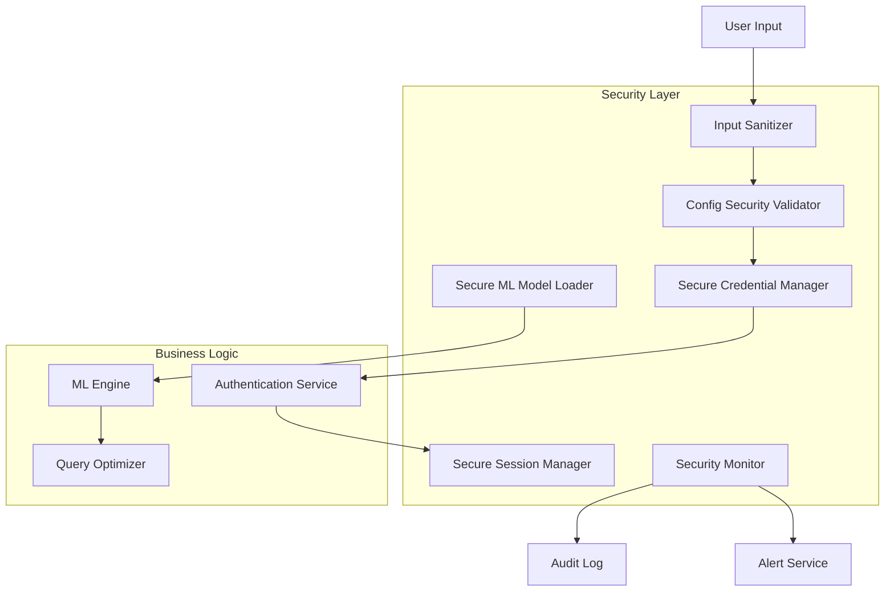

> ⚠️ Partially aspirational (flagged 2026-05-31): some classes/methods/APIs below are design documentation that does not exist in the current code; see inline TODO(docval) markers. Verify against `src/` before relying on any symbol.

# Qobuzarr Security Architecture Guide

## Overview

Qobuzarr implements defense-in-depth security architecture to protect user credentials, prevent injection attacks, validate ML models, and ensure secure API communication. This document outlines the comprehensive security model and implementation patterns.

## Security Design Principles

### 1. **Defense-in-Depth**

- Multi-layered security controls at every component level
- Input validation, output sanitization, and process isolation
- Fail-safe defaults with explicit security policies

### 2. **Least Privilege Access**

- Minimal required permissions for each component
- Isolated credential storage with time-limited access
- Restricted assembly loading and validation

### 3. **Secure by Default**

- HTTPS-only communications
- Automatic credential masking in logs
- Secure string handling for sensitive data

### 4. **Zero Trust Architecture**

- All inputs validated regardless of source
- ML models require signature verification
- API responses sanitized before processing

## Core Security Components

### Credential Management Layer

**Primary Class**: [`SecureCredentialManager`](../../src/Security/SecureCredentialManager.cs)<!-- TODO(docval): SecureCredentialManager not found in code as of 2026-05-31; real equivalent is StreamingTokenManager from Common -->

```csharp
// Secure credential storage with memory protection
var credentialManager = new SecureCredentialManager(logger);<!-- TODO(docval): SecureCredentialManager not found in code as of 2026-05-31 -->

// Store credentials securely using SecureString
credentialManager.StoreSecureCredential("qobuz_password", userPassword);

// Use credentials with automatic cleanup
await credentialManager.UseSecureCredentialAsync("qobuz_password", async password => 
{
    return await qobuzApi.AuthenticateAsync(email, password);
});
```

**Security Features**:

- **SecureString Integration**: Credentials stored using Windows SecureString API
- **Memory Protection**: Automatic memory clearing after use
- **Concurrent Access**: Thread-safe credential operations
- **Validation**: Security policy enforcement for credential format

**Implementation Details**:

- Credentials encrypted in memory using OS-level protection
- Automatic garbage collection prevention for sensitive strings  
- Audit logging for all credential operations
- Time-limited credential exposure patterns

### ML Model Security Layer

**Primary Class**: [`SecureMLModelLoader`](../../src/Security/SecureMLModelLoader.cs)

The ML model loader implements comprehensive validation for external machine learning assemblies:

```csharp
var modelLoader = new SecureMLModelLoader(logger);

// Load with signature verification (production mode)
var mlEngine = modelLoader.LoadSecureModel("/path/to/model.dll", requireSignature: true);

// Development mode (signature optional but logged)
var devEngine = modelLoader.LoadSecureModel("/path/to/model.dll", requireSignature: false);
```

**Security Validation Pipeline**:

1. **Path Traversal Protection**
   - Sanitizes and validates all file paths
   - Restricts loading to allowed directories only
   - Prevents `../` and other traversal attempts

2. **Assembly Whitelist Verification**
   - Maintains trusted assembly name patterns
   - Only loads assemblies matching approved patterns
   - Logs unauthorized loading attempts

3. **Cryptographic Hash Verification**
   - SHA-256 hash validation against trusted signatures
   - Hash mismatch detection and logging
   - Support for updating trusted hashes securely

4. **Digital Signature Validation**
   - Strong name signature verification
   - Public key token validation
   - Certificate chain validation (when available)

5. **Behavioral Validation**
   - Smoke testing of loaded ML models
   - Interface compliance verification
   - Runtime behavior validation

**Audit and Monitoring**:

```csharp
// Get security statistics for monitoring
var stats = modelLoader.GetSecurityStats();
Console.WriteLine($"ML Model Security: {stats.SuccessfulLoads}/{stats.TotalLoadAttempts} successful loads");

// Review audit trail
var auditLog = modelLoader.GetAuditLog();
foreach (var entry in auditLog.Where(e => e.Result != LoadResult.Success))
{
    Console.WriteLine($"Security Event: {entry.Result} at {entry.Timestamp}");
}
```

### Configuration Security Validation

**Primary Class**: [`SecurityConfigValidator`](../../src/Security/SecurityConfigValidator.cs)

Validates all user-provided configuration for security vulnerabilities:

```csharp
var validator = new SecurityConfigValidator(logger, credentialManager);
var result = validator.ValidateConfiguration(qobuzSettings);

if (result.HasCriticalIssues)
{
    throw new SecurityException($"Critical security issues detected: {result.CriticalIssues.Count}");
}

Console.WriteLine($"Security Score: {result.SecurityScore}/100 ({result.SecurityLevel})");
```

**Validation Categories**:

1. **Authentication Security**
   - Email/password format validation
   - Credential strength assessment  
   - Placeholder detection and warnings

2. **Injection Attack Prevention**
   - SQL injection pattern detection
   - XSS attempt identification
   - Path traversal prevention

3. **Network Security Validation**
   - HTTPS enforcement for API endpoints
   - Certificate validation requirements
   - Rate limiting configuration review

4. **Privacy Protection**
   - Cache duration validation
   - Credential exposure prevention
   - Logging sensitivity assessment

### Input Sanitization Layer

**Primary Classes**:

- [`InputSanitizer`](../../src/Security/InputSanitizer.cs) - compatibility facade over Common `Sanitize` for shared helpers, with local Qobuz validators for auth, paths, and metadata
- [`MetadataSanitizer`](../../src/Security/MetadataSanitizer.cs)

```csharp
// Sanitize user search queries
var safeQuery = InputSanitizer.SanitizeSearchQuery(userInput);

// Clean metadata from API responses
var cleanMetadata = MetadataSanitizer.SanitizeTrackMetadata(apiResponse);
```

**Sanitization Features**:

- HTML/XML tag removal from user inputs
- Unicode normalization and validation  
- File path security for metadata processing
- Special character escaping for SQL-like operations

### Session Management Security

**Primary Class**: [`SecureSessionManager`](../../src/Security/SecureSessionManager.cs)<!-- TODO(docval): SecureSessionManager not found in code as of 2026-05-31; real equivalent is SessionManager from src/Authentication/ -->

Manages Qobuz authentication sessions with security controls:

```csharp
var sessionManager = new SecureSessionManager(logger);<!-- TODO(docval): SecureSessionManager not found in code as of 2026-05-31 -->

// Create secure session with automatic expiration
var session = await sessionManager.CreateSecureSessionAsync(credentials);

// Validate session before use
if (sessionManager.IsSessionValid(session))
{
    var result = await qobuzApi.SearchWithSessionAsync(query, session);
}
```

**Session Security Features**:

- Automatic session token rotation
- Session timeout and expiration management
- Secure session storage with encryption
- Session validation and integrity checks

## Security Configuration

### Environment Variables

```bash
# Production security settings
QOBUZARR_REQUIRE_SIGNATURE=true           # TODO(docval): env var not found in code as of 2026-05-31
QOBUZARR_ADMIN_TOKEN=<secure_admin_token>  # Admin operations token
QOBUZARR_LOG_SECURITY_EVENTS=true         # TODO(docval): env var not found in code as of 2026-05-31
QOBUZARR_VALIDATE_CERTIFICATES=true       # TODO(docval): env var not found in code as of 2026-05-31

# Development/testing settings (less secure)
QOBUZARR_DEV_MODE=true                     # TODO(docval): env var not found in code as of 2026-05-31
QOBUZARR_SKIP_CERT_VALIDATION=false        # TODO(docval): env var not found in code as of 2026-05-31
```

### Configuration File Security

```json
{
  "Security": {
    "RequireModelSignatures": true,
    "MaxModelSize": 10485760,
    "ModelLoadTimeout": 30,
    "AllowedModelPaths": [
      "./plugins/Qobuzarr/ml/",
      "./ML/"
    ],
    "TrustedModelHashes": {
      "PersonalizedMLQueryOptimizer.dll": "SHA256_HASH_HERE"
    }
  },
  "Logging": {
    "SecurityEvents": true,
    "MaskCredentials": true,
    "AuditRetention": 1000
  }
}
```

## Security Monitoring and Alerting

### Security Event Categories

1. **Critical Events** (Immediate Response Required)
   - Injection attack attempts
   - Unauthorized ML model loading
   - Credential exposure or theft attempts
   - Hash mismatch in trusted assemblies

2. **Major Events** (Review Within 24 Hours)
   - Failed authentication attempts
   - Suspicious configuration changes
   - Network security policy violations
   - Privacy setting misconfigurations

3. **Informational Events** (Regular Review)
   - Successful security validations
   - ML model loading success
   - Session creation and termination

### Monitoring Integration

```csharp
// Example security monitoring integration
public class SecurityMonitoringService<!-- TODO(docval): SecurityMonitoringService not found in code as of 2026-05-31 -->
{
    public void OnSecurityEvent(SecurityEventType eventType, string message, object context)
    {
        switch (eventType)
        {
            case SecurityEventType.InjectionAttempt:
                // Alert security team immediately
                _alertingService.SendCriticalAlert("Injection Attack", message);
                break;
                
            case SecurityEventType.ModelLoadFailure:
                // Log for security review
                _auditLogger.LogSecurityEvent(eventType, message, context);
                break;
        }
    }
}
```

## Security Best Practices for Developers

### 1. **Credential Handling**

```csharp
// ✅ SECURE: Use SecureCredentialManager
credentialManager.UseSecureCredential("password", password => {
    return AuthenticateWithQobuz(email, password);
});

// ❌ INSECURE: Direct string usage
var result = AuthenticateWithQobuz(email, plainTextPassword);
```

### 2. **Input Validation**

```csharp
// ✅ SECURE: Validate all inputs
var validator = new SecurityConfigValidator(logger);
var validation = validator.ValidateConfiguration(settings);
if (validation.HasCriticalIssues) throw new SecurityException();

// ❌ INSECURE: Trust user inputs
await qobuzApi.SearchAsync(userQuery); // No validation
```

### 3. **ML Model Loading**

```csharp
// ✅ SECURE: Use SecureMLModelLoader
var model = secureLoader.LoadSecureModel(modelPath, requireSignature: true);

// ❌ INSECURE: Direct assembly loading
var assembly = Assembly.LoadFrom(untrustedPath);<!-- TODO(docval): Assembly.LoadFrom usage pattern documented but not a security issue in context -->
```

### 4. **Logging Sensitive Data**

```csharp
// ✅ SECURE: Mask sensitive data
logger.Info("Authentication for user: {0}", 
    credentialManager.MaskSensitiveData(email));

// ❌ INSECURE: Log credentials directly  
logger.Info("Password: {0}", password); // Never do this
```

## Security Incident Response

### Incident Classification

**Level 1 - Critical Security Incident**

- Active injection attack in progress
- Credential theft or exposure detected
- Malicious ML model loading attempt
- Unauthorized access to admin functions

**Level 2 - Major Security Issue**

- Configuration security violations
- Failed authentication beyond threshold
- Suspicious network activity patterns
- Privacy policy violations

**Level 3 - Minor Security Concern**

- Informational security events
- Configuration recommendations
- Performance-related security impacts

### Response Procedures

1. **Immediate Response** (Level 1)
   - Disable affected component immediately
   - Clear all cached credentials
   - Generate security incident report
   - Notify security team and users

2. **Investigation Phase**
   - Review audit logs and security events
   - Analyze attack vectors and impact
   - Document findings and evidence
   - Develop remediation plan

3. **Recovery and Hardening**
   - Apply security patches or fixes
   - Update security configurations
   - Enhance monitoring and detection
   - Conduct post-incident review

## Security Testing and Validation

### Automated Security Testing

```bash
# Run security-focused tests
dotnet test --filter "Category=Security"

# Run vulnerability scanning
dotnet list package --vulnerable

# Validate configuration security
dotnet run -- config validate --security
```

### Manual Security Review Checklist

- [ ] All user inputs validated and sanitized
- [ ] Credentials stored using SecureString patterns
- [ ] ML models loaded through secure loader only
- [ ] Network communication uses HTTPS exclusively
- [ ] Sensitive data masked in all log outputs
- [ ] Session management follows security best practices
- [ ] Configuration validation prevents injection attacks
- [ ] Security monitoring and alerting configured

## Security Updates and Maintenance

### Security Update Process

1. **Vulnerability Assessment**
   - Monitor security advisories for dependencies
   - Review code for new security patterns
   - Validate ML model signatures regularly

2. **Update Deployment**
   - Test security updates in isolated environment
   - Validate security configurations remain intact
   - Monitor for security regressions post-update

3. **Security Configuration Maintenance**
   - Review and rotate admin tokens regularly
   - Update trusted ML model hashes as needed
   - Audit security event logs periodically

### Dependencies Security

```xml
<!-- Package vulnerability scanning -->
<PackageReference Include="SecurityCodeScan.VS2019" Version="5.6.7" PrivateAssets="all" />
<PackageReference Include="Microsoft.CodeAnalysis.NetAnalyzers" Version="7.0.4" PrivateAssets="all" />
```

## Security Architecture Diagram



This security architecture ensures comprehensive protection while maintaining performance and usability for the Qobuzarr plugin ecosystem.
